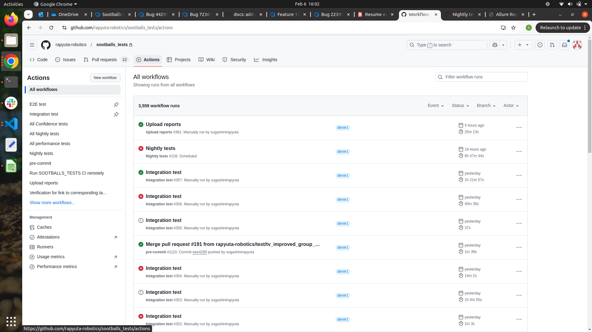
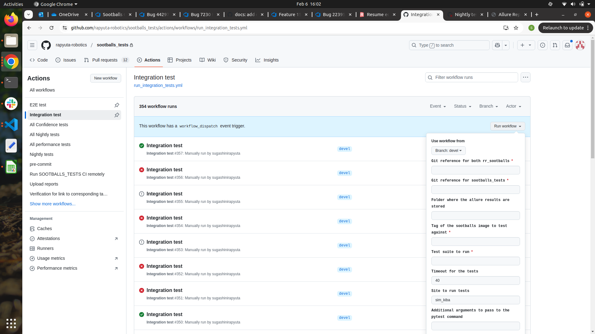
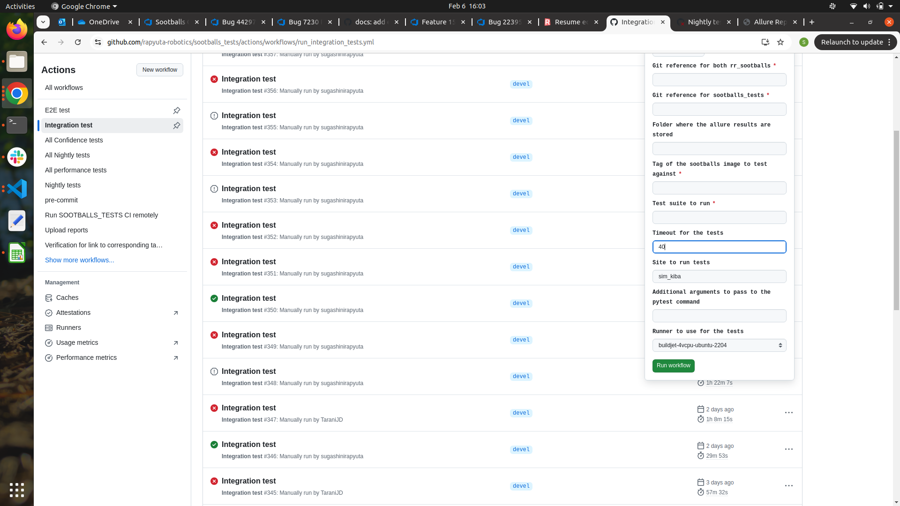
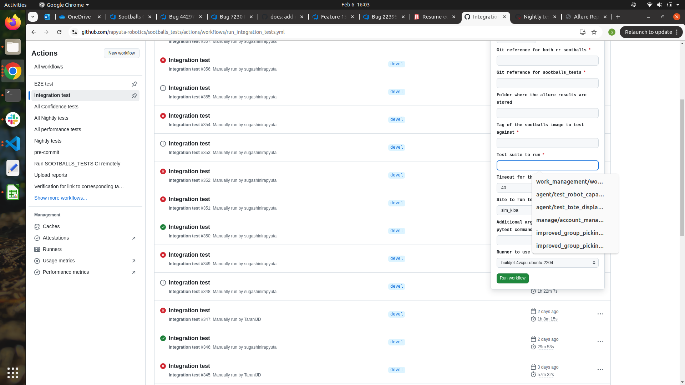
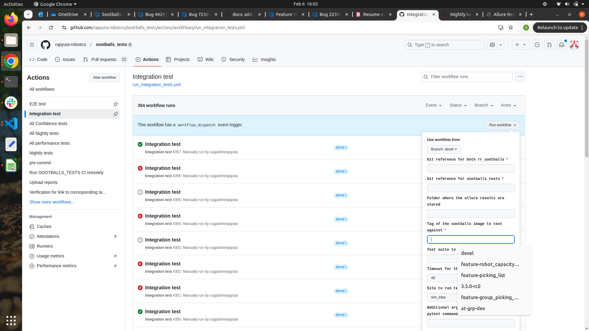
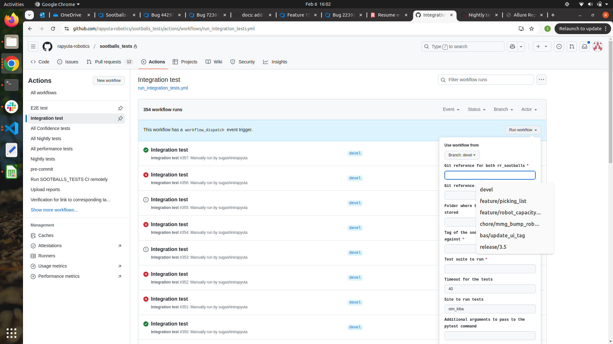
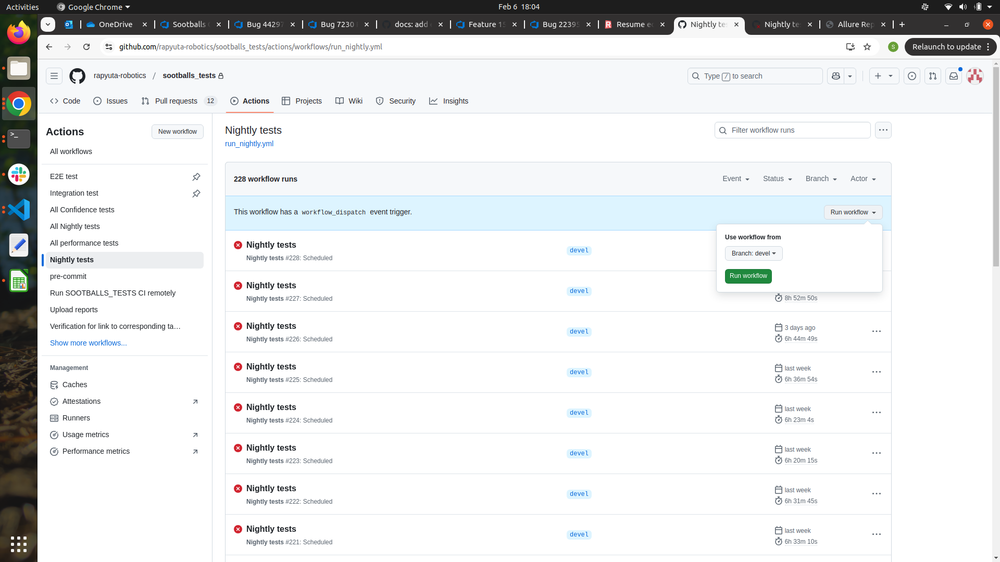
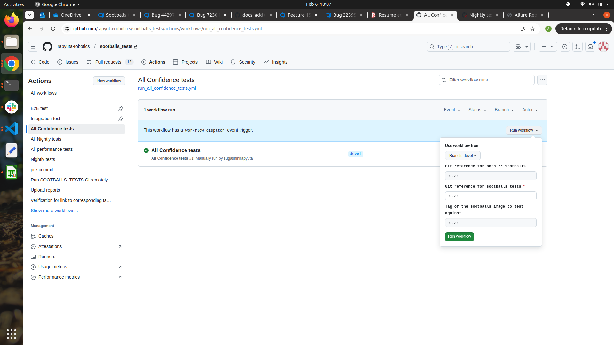
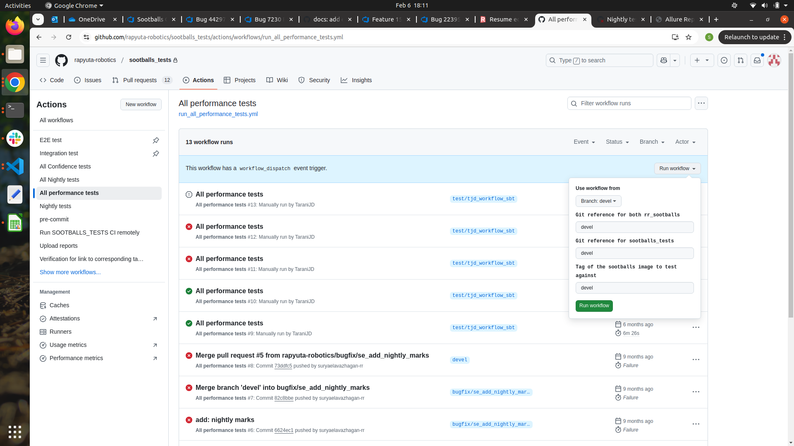
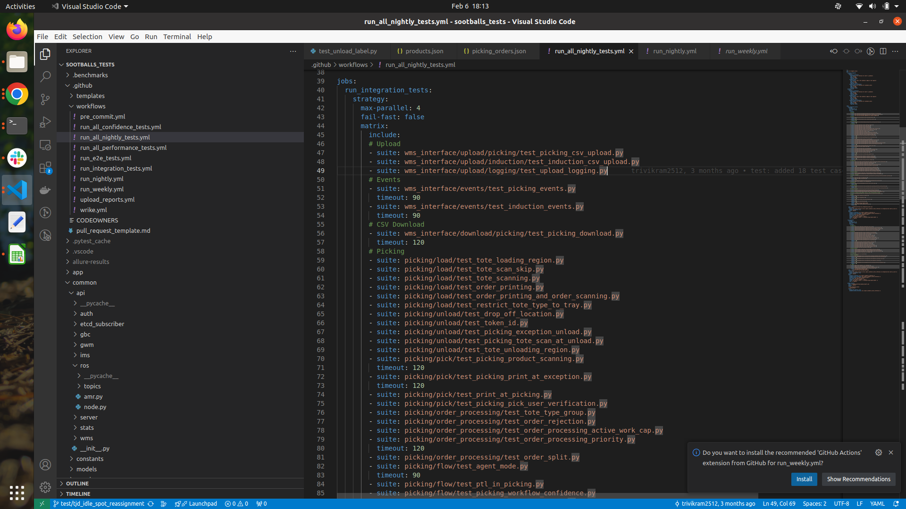

=======
CI RUNS
=======

CI Run for Specific Suite:
--------------------------

1. Initiate integration/E2E test:
~~~~~~~~~~~~~~~~~~~~~~~~~~~~~~~~~
    Initiate test run for specific suite to ensure that the test suite is passing in devel or release branch or in feature branch

Navigate to Actions tab in sootballs_test repo 

.. raw:: html

      

Navigate to integration/E2E test tab in Action module

.. raw:: html

      

Steps to Run CI Workflow
^^^^^^^^^^^^^^^^^^^^^^^^

1. Click run_workflow icon and fill the details like below,

2. Use workflow from --> this is always devel only. We don’t have to change this

3. Git reference for both rr_sootballs --> branch of rr_sootballs

   - If we need to run in devel, enter “devel”
   - If we need to run in release branch, enter release name
   - If we need to run in specific feature branch, enter the feature branch name

4. Git reference for sootballs_tests --> branch of sootballs_test repo (our code branch)

5. Tag of the sootballs image to test against --> tag of the rr_sootballs branch.

   - For example, for devel branch, “devel” is tag.  
   - For release branch “3.5.0-rc1”, “3.5.0-rc0”, etc like, for our particular test branch “branch name” should be used.

6. Test suite to run --> path to the test suite should be entered in this

7. Timeout for the tests (minutes) --> default timeout will be 40. If that suite takes long time, we can change.

.. image:: ci_run_pic/pic3.png
   :alt: CI Run
   :align: center
   :width: 600px

.. raw:: html

      

.. raw:: html

      

.. raw:: html

      

.. raw:: html

      

.. raw:: html

      

.. raw:: html

      

2. CI Run for Nightly Tests
~~~~~~~~~~~~~~~~~~~~~~~~~~~

Navigate to the Nightly tests tab and click workflow.  
Run the workflow in whichever branch we need.

.. raw:: html

      

3. CI Run for Confidence tests:
~~~~~~~~~~~~~~~~~~~~~~~~~~~~~~~

Navigate to Confidence tests tab and click workflow. In rr_sootballs reference we can give in which branch of rr_sootballs we are going to run the suite. In sootballs test, we can give in which branch of sootballs_tests we are going to run the suite. 

.. raw:: html

      

4. CI Run for Performance tests:
~~~~~~~~~~~~~~~~~~~~~~~~~~~~~~~~

Navigate to Performance tests tab and click workflow. In rr_sootballs reference we can give in which branch of rr_sootballs we are going to run the suite. In sootballs test, we can give in which branch of sootballs_tests we are going to run the suite. 

.. raw:: html

      

5. Add every suite in run_all_nightly file to run in daily ci while adding a new suite everytime.
~~~~~~~~~~~~~~~~~~~~~~~~~~~~~~~~~~~~~~~~~~~~~~~~~~~~~~~~~~~~~~~~~~~~~~~~~~~~~~~~~~~~~~~~~~~~~~~~~

.. raw:: html

      