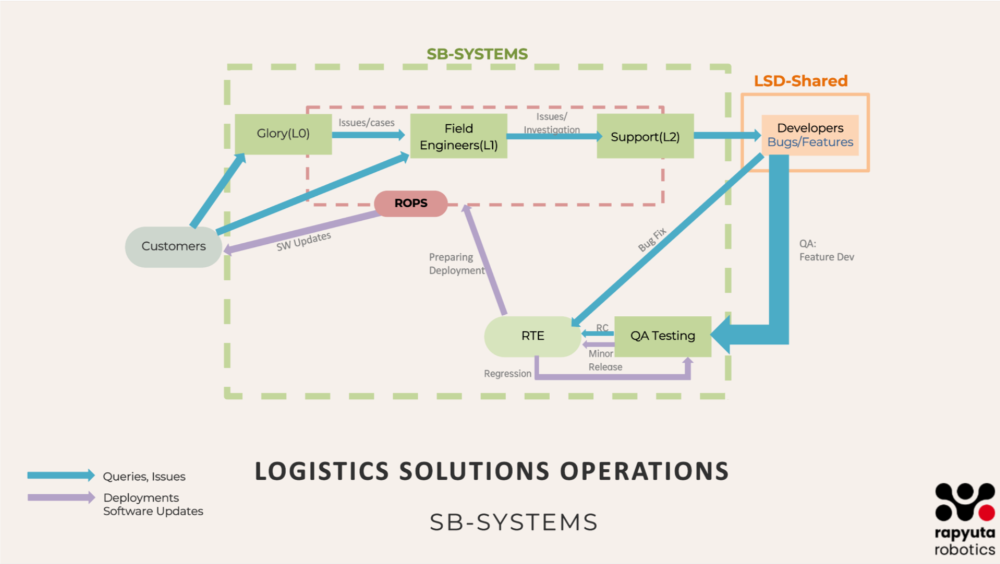

Introduction
============

This book defines the essential processes, tools, and best practices that empower teams to collaborate seamlessly, drive efficiency, and scale with confidence. This book is designed to:

- **Standardize Processes:** Define clear workflows for each squad to ensure consistency.
- **Improve Collaboration:** Highlight inter-team dependencies and best practices for smooth integration.
- **Enhance Knowledge Sharing:** Provide in-depth technical and process documentation for current and future team members.
- **Optimize Performance:** Define measurable KPIs and continuous improvement strategies.

Whether you're an existing team member or a **Fresher to Systems Team**, this book will help you navigate the **System Excellence framework** and contribute effectively.

SB- Systems Architecture Overview
---------------------------------

.. raw:: html

      

Customers will raise queries and report issues encountered during daily product usage. These requests are directed to either the **Glory team** or **Field Engineers** through issue tickets in **Azure**, as detailed in this document.

Once a ticket is raised, the **Support Team** will review and categorize it into appropriate task types, such as **issues/cases**, **bugs**, or **feature requests**, ensuring a structured approach to resolution.

The **Support Team** will handle and resolve general **issues/cases**. However, **bugs** and **feature requests** will be escalated by creating tickets for the **Development Team**, ensuring they are addressed systematically and integrated into the development pipeline.

The **Development Team** will work on fixing reported **bugs**, updating the **software**, and implementing **new features**. Once the development is complete, the updated software will be sent to the **QA Team** for thorough testing to ensure functionality, stability, and compliance with requirements.

Once the **QA Team** has tested and validated the updates, the release will be handed over to the **RTE (Release Train Engineer)**, who will ensure proper alignment and readiness for deployment.

If any issues/cases are identified during this stage, the changes will go through the necessary iteration loop for fixes and retesting. Once cleared, the final release will be deployed by the **ROPS Team** or **Field Engineers**, ensuring a smooth rollout to production.

All necessary process documents detailing this overall flow are provided below. These documents explain:

- **Why** each process is necessary
- **How** each process is executed
- **Which tools** are used to achieve seamless implementation

Here's a refined, structured guide integrating your notes into a comprehensive **L2 to Dev Team Process Flow:** 
