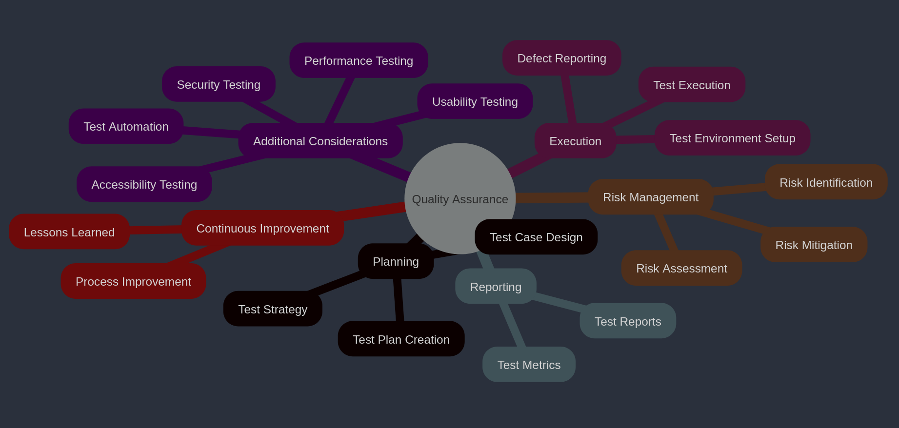
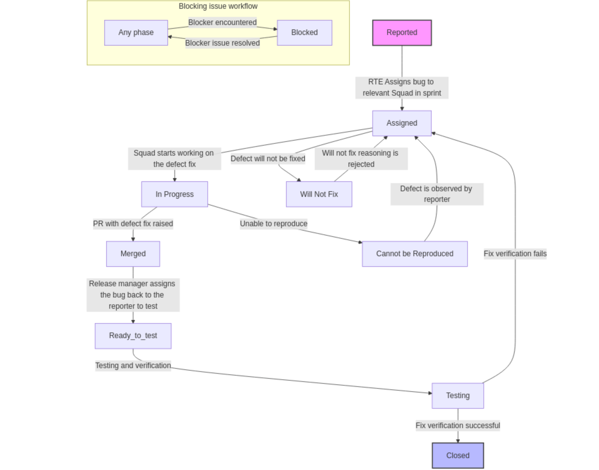
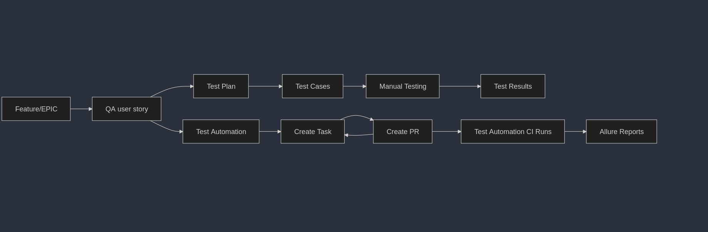
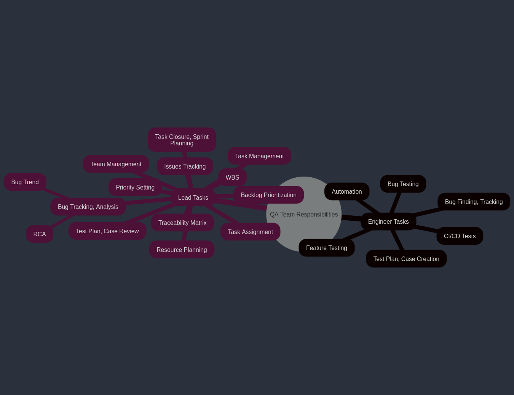
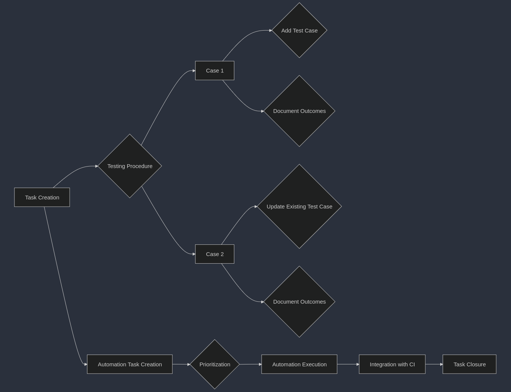
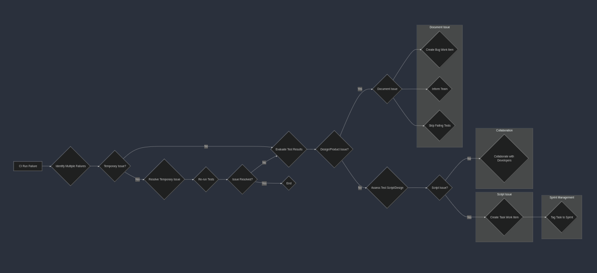
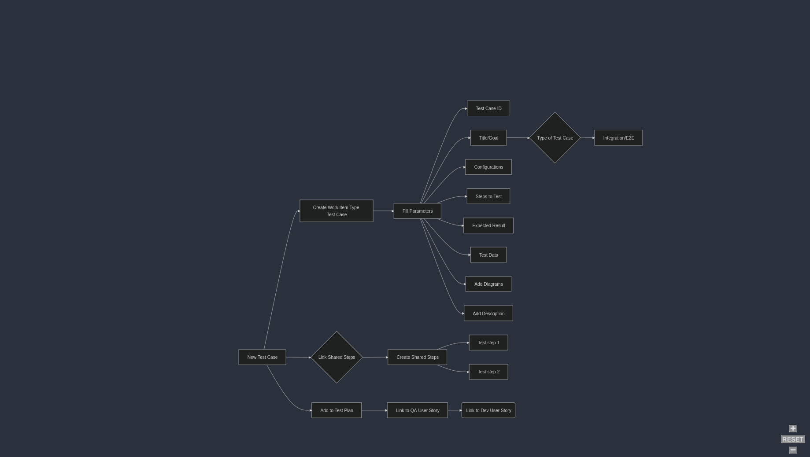
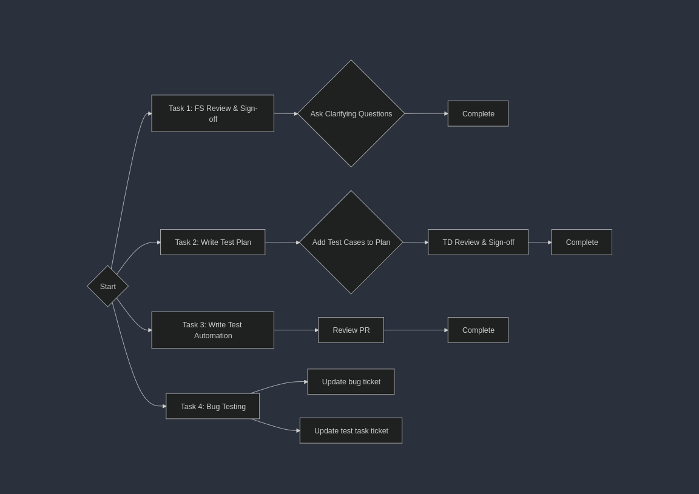

==========
QA Process
==========

.. raw:: html

      

Bug Life Cycle
---------------

.. raw:: html

      

Traceability Matrix 
--------------------

**EPIC/Feature -> QA User Story - Azure Devops (Unique test cases)**

.. list-table:: 
   :header-rows: 1
   :widths: 20 20 20 20

   * - EPIC/Feature
     - User Story
     - Test Case ID
     - Status
   * - EPIC1
     - US1
     - TC_001
     - Passed
   * - EPIC1
     - US1
     - TC_002
     - Passed
   * - Feature2
     - US2
     - TC_003
     - Passed
   * - EPIC3
     - US3
     - TC_004
     - Passed
   * - EPIC3
     - US3
     - TC_005
     - Passed

.. raw:: html

      

**Tracking Our EPIC/Feature Requirements in the Sootballs Dashboard**

As part of our commitment to delivering high-quality products, we are utilizing our QA user story to conduct comprehensive testing linked to each EPIC in the Sootballs dashboard. Each EPIC encapsulates unique requirements that our development team is diligently working on. 

To streamline our efforts, we will focus on a single user story within the sootballs-common-dev area for tracking requirements and visualizing our progress on the dashboard. 

Our QA Process for Each EPIC
-----------------------------

For every QA user story associated with an EPIC, we will implement a series of tasks on our QA board to ensure thorough coverage and testing. Here’s what you can expect:

1. **Test Plan**:  
   Develop a detailed test design for the specified requirement.

2. **Test Cases in Test Plan**:  
   Create and document test cases in Azure that align with the requirement.

3. **Manual Testing**:  
   Execute the test cases manually, capturing all results for review.

4. **Test Automation CI Runs**:  
   Automate selected test cases, with Allure reports generating and documenting test results.

5. **Test Automation - PR Tracking**:  
   For each test case automation, create a pull request (PR), create a corresponding task, and link it back to the requirement to maintain traceability.

By following this structured approach, we ensure that each requirement (i.e., EPIC) is thoroughly tracked with all necessary QA tasks, leading us toward the successful delivery of a high-quality product.

Team Responsibilities
----------------------

.. raw:: html

      

BUG Testing Process 
--------------------

.. raw:: html

      

Step 1: Task Creation
~~~~~~~~~~~~~~~~~~~~~~

- **Lead**: Create a task for the bug if it's already planned for the sprint.
- **Ad-hoc Testing**: If the bug is tested on an ad-hoc request, the test engineer must create a task and add it to the current sprint iteration.

Step 2: Testing Procedure
~~~~~~~~~~~~~~~~~~~~~~~~~

- **Case 1**:
  1. **Add Test Case**: While testing manually, create a new test case and link it. Plan to automate it later.
  2. **Document Outcomes**: Record the test outcomes in the bug ticket after manual verification. Ensure to create and link a new work item of type *"test case."*

- **Case 2**:
  1. **Update Existing Test Case**: Add a new test step to an existing test case. Automate it if feasible; if not, plan for automation later.
  2. **Document Outcomes**: Record the test outcomes in the bug ticket after manual verification.

Step 3: Automation Task Creation
~~~~~~~~~~~~~~~~~~~~~~~~~~~~~~~~~

- **QA Lead**: Create a backlog task for test automation.
- **Assigned Test Engineer**: Discuss whether to modify existing test scripts or create new ones.

Step 4: Automation Execution
~~~~~~~~~~~~~~~~~~~~~~~~~~~~~~

- **Prioritization**: Execute test automation based on backlog prioritization.

Step 5: Integration with CI
~~~~~~~~~~~~~~~~~~~~~~~~~~~

- **Add to CI**: Include the test script in the regression testing - Continuous Integration (CI) runs.
- **Test Placement**: Determine the type of test placement (e.g., nightly, confidence, integration).
- **Assigned Test Engineer**: Discuss the automation task and placement.

Step 6: Task Closure
~~~~~~~~~~~~~~~~~~~~~

- The task can be closed only after merging the Pull Request (PR) in the `sootballs_tests` repository.
- Update the GitHub PR request with this task.

===========================================================================

PROCESS TO DO on CI RUN FAILURES
---------------------------------

.. raw:: html

      

Steps to Handle Test Script Failures in Regression Testing CI Run
~~~~~~~~~~~~~~~~~~~~~~~~~~~~~~~~~~~~~~~~~~~~~~~~~~~~~~~~~~~~~~~~~~

1. Identify Multiple Failures (🔍)
   - Check if multiple test failures are linked to the same reason (e.g., network timeout).

2. Resolve Temporary Issues (🛠️)
   - If a temporary issue (like network unavailability) caused the failures, wait until it's fixed.
   - Re-run all test cases to verify if failures persist.

3. Evaluate Test Results (⚖️)
   - If no issues are observed after the fix, the previous failures can be disregarded.
   - If issues still exist, proceed to the next step.

4. Document the Issue if it's a design change or product issue (📝)
   - If the quality engineer is unsure of the failure's cause:
      - Create a bug work item.
      - Post in the **#rr_sootballs_qa** channel or bring it up during the standup to inform the team.
      - Skip the failing tests in nightly runs, mentioning the related Azure “bug” ID.

5. Assess Test Script or Design Changes (⚙️🔧)
   - If the failure is due to a problem with the test script:
      - Create a task work item titled: **Fix for the CI failure on <script title-subtitle>**

6. Sprint Management (📅)
   - The QA lead should ensure the task is tagged to the current sprint if it is to be fixed in this sprint.

7. Collaborate with Developers (👥)
   - The QA lead should consult developers regarding any bugs suspected to be product-related rather than script-related.

PROCESS TO WRITE TEST CASE
---------------------------

.. raw:: html

      

The decorator @allure.link must be added to every PR when we are adding a new test case which will help us to link the automation run with azure. 
 
    @allure.link( 
        url="https://dev.azure.com/rapyuta-robotics/sootballs/_workitems/edit/6830/", 
        link_type=LinkType.TEST_CASE, 
    ) 

=================================================================

Types of Tasks in Azure devops - sprint board management 
--------------------------------------------------------

.. raw:: html

      

1. Requirement Analysis
~~~~~~~~~~~~~~~~~~~~~~~~

- **Understand the software**:
  Review the feature documents, user stories, and other relevant documentation to understand what the software is supposed to do.
  Example: We will get the feature request in Azure DevOps.

- **Discussion with stakeholders**:
  During meetings with the development team manager or feature owner, QA should ask relevant questions to clarify requirements.
  If unclear, reach out to the product team for further clarification.

- **Identify testing objectives**:
  Determine what needs to be tested and identify the scope.

- **Create QA user story**:
  Create a QA user story for the requirement user story in Sootballs Dashboard for the release if it's a feature request user story. Outline the testing scope whichever feasible to, approach, resources, schedule, and deliverables. 

2. Test Planning & Design
~~~~~~~~~~~~~~~~~~~~~~~~~~

- **Design test cases**:
  Create detailed test cases that cover all functional, End to end tests as well as edge cases of the feature or the fixes provided for bugs. 

  - **Test steps**:  The specific actions to be performed during the test.
  - **Configuration**: Write the needed configuration in the test case.  Example : 
    - **Test data**: The input data used for the test say order.csv files to be attached to the test cases. 
  - **Expected results**: The anticipated outcome of the test.

- **Create test scenarios**:
  Develop higher-level scenarios that represent real-world usage of the feature by customer use cases. Consider all the aspects of how it will be used by the customer.

- **Update task in Azure DevOps**:
  Update the task created in azure devops for that test plan. Ensure that the task is linked to the QA user story which is linked to the requirement user story in Sootballs dashboard. 

3. Test Environment Setup
~~~~~~~~~~~~~~~~~~~~~~~~~~

- **Prepare the environment**:
  Set up the necessary environment by updating the correct git version, pulling images hardware, software, and network configurations, environment variables if any and set up the environment.

4. Test Execution
~~~~~~~~~~~~~~~~~~

- **Execute test cases**:
  Perform manual or automated tests according to the test plan.

- **Record test results**:
  Document the actual results of each test case, including any deviations from expected results.

- **dentify and log defects**:
  Report any bugs found during testing using the “Bug” Workitemtype in 	Azuredevops.

- Link the manual test case and automated test case if 	automation completed to the bug in “Steps to reproduce” 

- If we have the automated test case failing, skip the test 	case by using pytest skip test and also link the azure bug workitemtype in git and make a commit. Once the defect is fixed, we need to re-test this test case and again make a PR. 

5. Defect Tracking & Retesting
~~~~~~~~~~~~~~~~~~~~~~~~~~~~~~~

- **Track and manage defects**:
  Monitor the status of reported defects and work with developers to resolve them.

- **Retest fixed defects**:
  Re-execute the affected test cases to verify that the fixes are effective.

6. Regression Testing
~~~~~~~~~~~~~~~~~~~~~~
- **Perform regression tests:** Run tests on 	previously tested areas to ensure that new changes or bug fixes have not introduced new problems. We have a separate document for the CI 	runs for regression. It is explained in detail in that document. 
- All new test cases should be added to CI workflows and executed in daily runs.
  Refer to the CI regression document for details.

7. Test Reporting
~~~~~~~~~~~~~~~~~~

- **Generate test reports:** Summarize the testing results, including the number of tests executed, the number of failed cases, and the overall test coverage. We use allure reports, and it is integrated in our test suite and generated in the daily CI runs. 
- **Analyze test results:** Identify areas for improvement in the software or the testing process.

- **Allure reports**:
  Integrated with the test suite and auto-generated in daily CI runs.

- **Analyze results**:
  Identify improvement areas in the product and testing process.

8. Release Testing
~~~~~~~~~~~~~~~~~~~

- **Perform final testing:** Conduct a final round of testing before the software is released to production.

9. Post-Release Activities
~~~~~~~~~~~~~~~~~~~~~~~~~~~

- **Monitor production issues:** 	Track any issues reported by end-users after the software is released. 	 
- **Conduct post-release testing:** Perform additional testing to identify any issues that were not discovered during the initial testing phases. 	 
- **Continuously improve the testing process:** 	Analyze the results of each testing cycle to identify areas for 	improvement and refine the testing approach for future projects. 