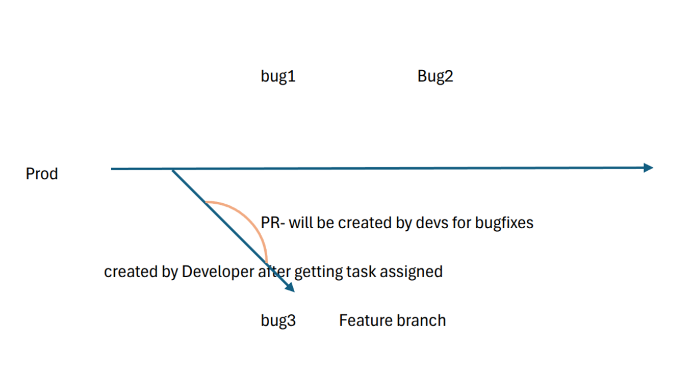
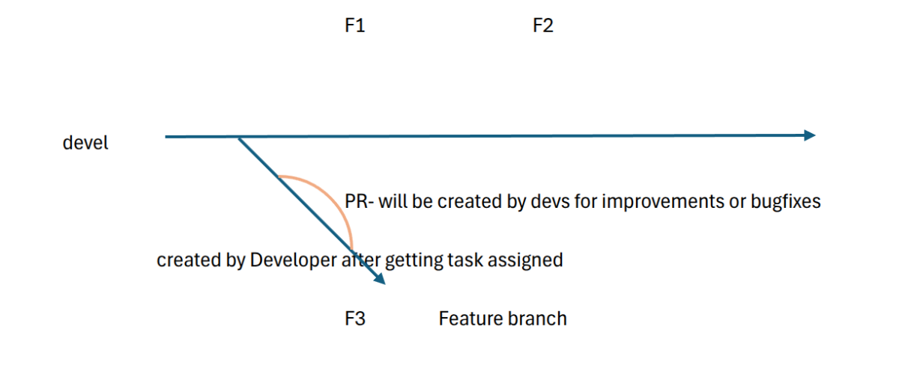

RTE Process: Managing Release Flow & Coordination
=================================================

The **Release Train Engineer (RTE)** plays a crucial role in ensuring a smooth transition from development to deployment by managing bug fixes, feature releases, and coordinating regression testing before promoting releases to production. 

Feature & Bug Management 
------------------------

Once **QA signs off on testing,** the RTE oversees the next steps for both **feature releases (FR) and bug fixes:** 

   - **Feature Releases (FR):**
      - All tasks exist in **different branches,** ensuring independent development and review. 
      - **All PRs remain in draft** until they are ready for merging. 

   - **Bug Fixes:** 
      - **Bugs are planned sprint-wise,** ensuring structured resolution. 
      - Each bug ticket must include clear reproduction steps to avoid ambiguity. 
      - The standard workflow follows **L2 → RTE → Dev → RTE** before proceeding further. 
      - Unlike features, **completed bug fixes are first reviewed by RTE, not QA,** to ensure correctness and necessary documentation updates. 
      - Developers must **refine and confirm the reproduction steps,** if necessary, before passing the fix to QA. 

Regression Testing & Bug Loops
~~~~~~~~~~~~~~~~~~~~~~~~~~~~~~

   - QA performs **focused regression** for each bug fix rather than a full regression, ensuring that specific issues are validated. 
   - **Why is full regression not happening?** This needs discussion with QA to evaluate gaps. 
   - **Are bugs being deprioritized?** If so, involving more development resources within the systems team may be required. 
   - If new bugs are discovered during regression, **new bug tickets are created,** initiating another **dev → QA → RC release cycle.**
   - This process repeats **until regression completes without issues.**

RC Promotion & Production Deployment
~~~~~~~~~~~~~~~~~~~~~~~~~~~~~~~~~~~~

   - Once **all regression tests pass,** the **RTE promotes the RC (Release Candidate) to a production release** (RC to Production Release Guide-Inprogress). 
   - After **release promotion,** the **ROPS team** takes over production deployment. 
   - With support from the **FE team,** ROPS ensures that the final software is successfully deployed to production environments. 

.. raw:: html

      

.. raw:: html

      
